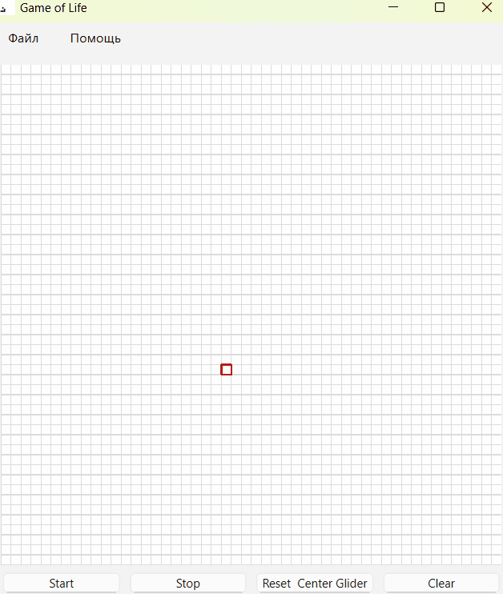
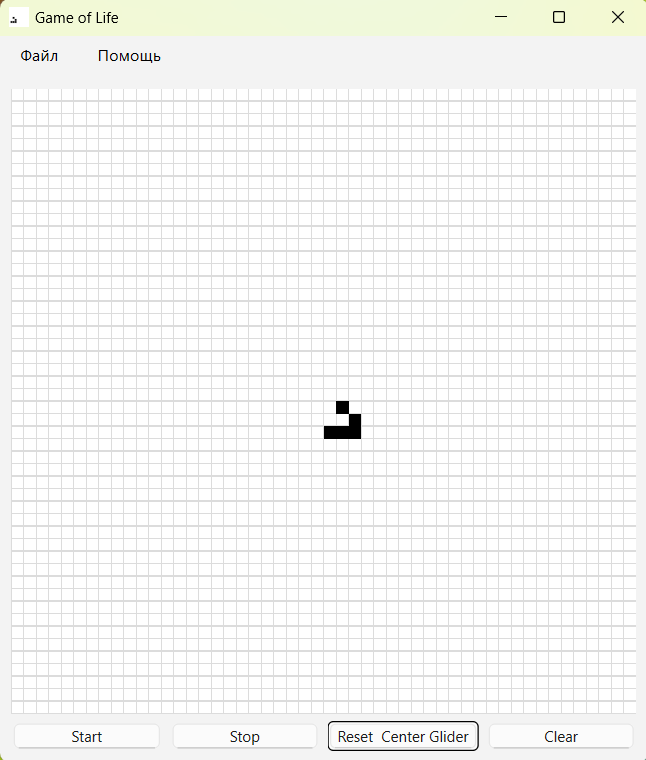
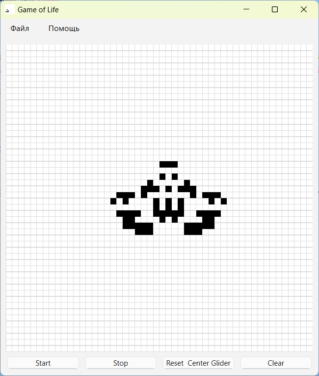
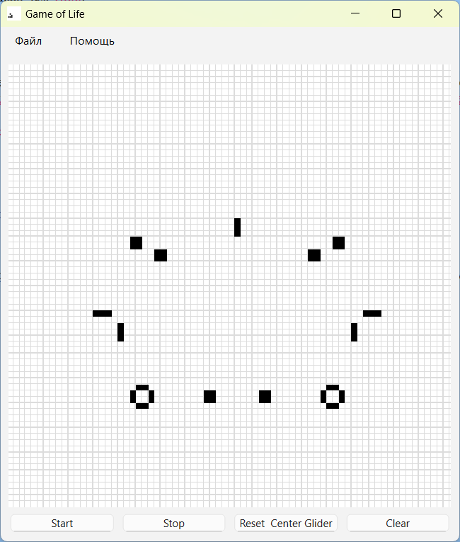

**[🇷🇺 ЧИТАТЬ НА РУССКОМ (README-RU.md)](README-RU.md)**

# Python & PyQt6 Conway's Game of Life

**Project for Yandex Lyceum**

This is a feature-rich implementation of Conway's Game of Life, built with Python using the PyQt6 framework. The project features an infinite grid, camera control, a cursor system, as well as capabilities for saving, loading, and managing patterns via the file system and a database.

## 📸 Demo

*Visualization of the simulation process.*

## 🖼️ Screenshots

| Initial State | Complex Pattern | Simulation Process |
|:---:|:---:|:---:|
|  |  |  |

## Features
- **Infinite Grid:** The simulation is unbounded, allowing figures to move indefinitely without borders.
- **Camera System:** Full view control via zooming (Mouse Wheel) and panning (Right Mouse Button drag).
- **Precise Cursor Input:** A blinking cursor ensures convenient cell placement and removal using both keyboard and mouse.
- **Save & Load:** Patterns can be saved to `.txt` files and loaded back via the "File" menu.
- **Pattern Library:** Built-in library based on SQLite database for storing, quick loading, and deleting your favorite patterns.
- **Multi-window Interface:** Includes a separate "Help" window with tabs describing controls and rules.
- **Automated Build:** The project is configured to automatically compile into a single `.exe` file for Windows via GitHub Actions.

## Controls

### Mouse
| Action | Button | Description |
|---|---|---|
| **Zoom** | `Mouse Wheel` | Zooms the view in or out. |
| **Pan** | `Right Mouse Button` | Moves the camera across the grid. |
| **Move Cursor** | `Left Mouse Button` | Instantly moves the cursor to the specific cell. |

### Keyboard
| Action | Key | Description |
|---|---|---|
| **Move Cursor** | `Arrow Keys` | Moves the cursor one cell at a time. |
| **Place/Remove Cell**| `Enter` | Inverts the state of the cell under the cursor. |

## Menus
- **File:**
    - `Pattern Library...`: Opens the database management window for patterns.
    - `Save Pattern...`: Saves the current grid state to a text file.
    - `Load Pattern...`: Loads a grid state from a text file.
- **Help:**
    - `Help`: Opens a window with descriptions of controls, rules, and program info.

## Automated Build & Download
---
This project is distributed as a ready-to-run `.exe` file for Windows that requires no installation.

The build is performed automatically via **GitHub Actions** upon every repository update.

**To download and run the game:**

https://github.com/uberd1/GameOfTheLife/releases/tag/1.0.0